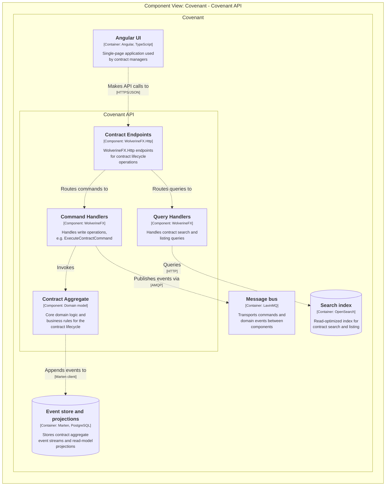

# Backend architecture

The [Architecture Overview](/architecture/overview) shows Covenant's containers, including the Covenant API as a single box. This page zooms one level further into that box — a C4 [Component](https://c4model.com/) view of what's actually running inside a single Covenant API instance, generated from the same [`workspace.dsl`](https://github.com/sszakal/x86cc.Documentation/blob/main/workspace.dsl) as the Context and Container diagrams.

## Instance architecture (C4 model)

Requests enter through the WolverineFX.Http **Contract Endpoints**, which route write operations to **Command Handlers** and reads to **Query Handlers** — this is the same command/query split shown in the [Command and event flow](/architecture/overview#command-and-event-flow) sequence diagram, just from the "what code exists" angle rather than "what happens over time." Command handlers invoke the **Contract Aggregate** (the domain model, matching the Domain layer in the [Onion architecture](/architecture/overview#onion-architecture-layers) diagram), which appends events to the event store; query handlers bypass the domain model entirely and read straight from the search index, since queries never need business-rule validation.
