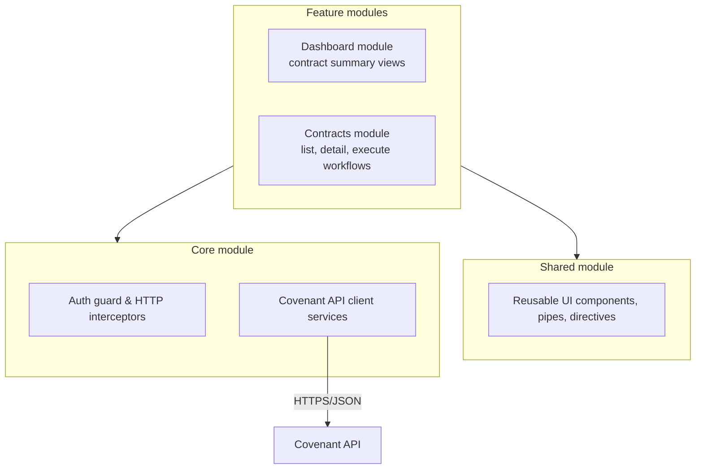

# Frontend architecture

The Angular UI (see the [Architecture Overview](/architecture/overview)) follows Angular's own Core/Shared/Feature module convention — a similar "dependencies only point one way" rule to the backend's [Onion architecture](/architecture/overview#onion-architecture-layers), just applied to frontend modules instead of backend layers.

Feature modules (`Dashboard`, `Contracts`) depend on `Shared` and `Core`, never on each other — cross-feature navigation goes through the router, not direct imports. `Core` is imported once at the application root and provides singletons every feature needs: the auth guard and HTTP interceptors (attaching auth tokens, handling 401s), and the API client services that are the only thing in the app allowed to call the Covenant API directly. `Shared` holds presentational building blocks (components, pipes, directives) with no knowledge of any specific feature. Each feature module manages its own local view state with Angular signals; there's no cross-feature global store, since Covenant's UI doesn't share view state across features.
