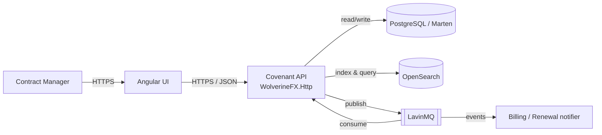
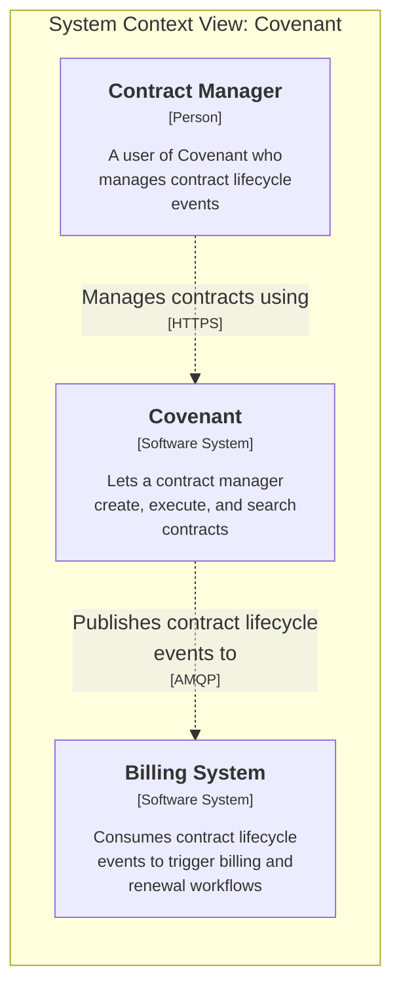
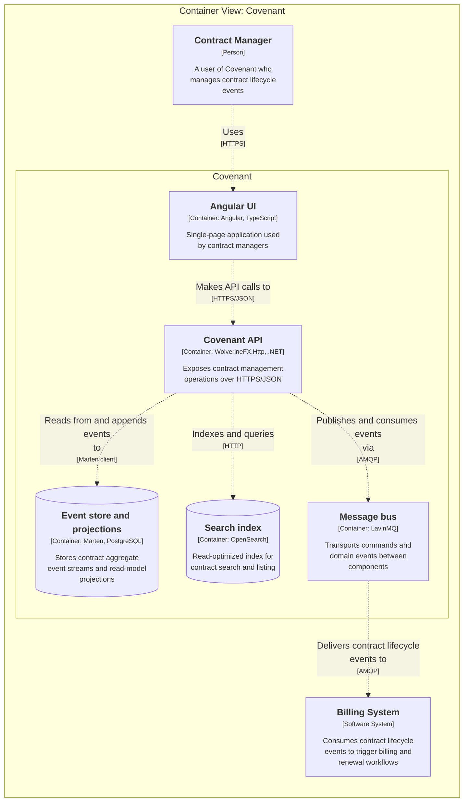
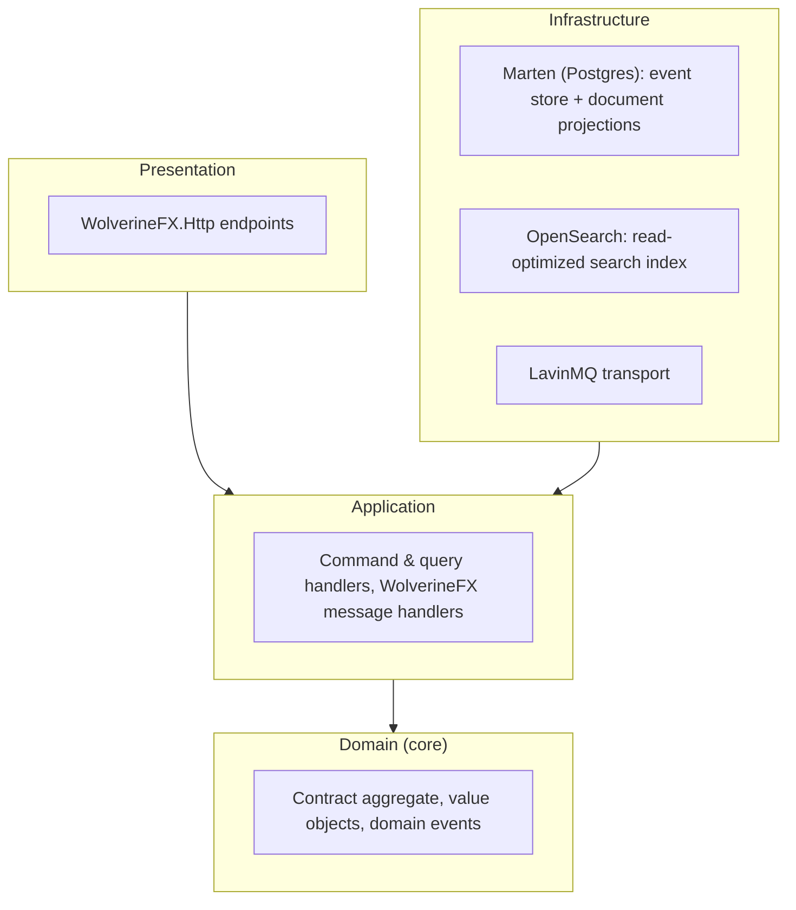
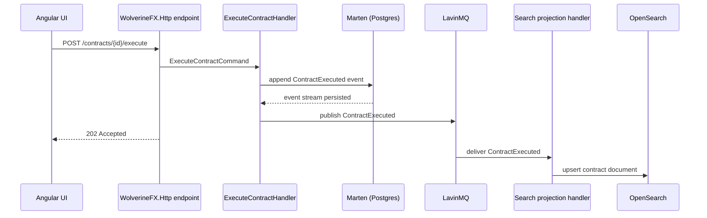
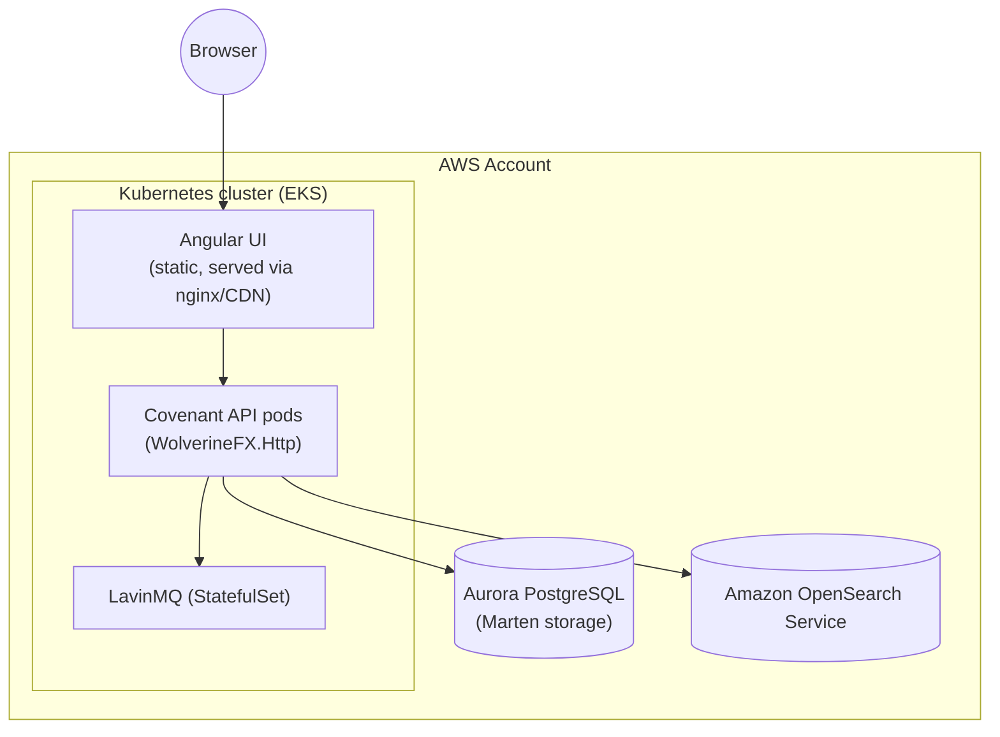

# Architecture overview

Covenant follows **Clean (Onion) Architecture**: business rules live at the center, with infrastructure concerns — HTTP, persistence, search, messaging — pushed to the outer edges and swapped in through interfaces defined by the core.

## System context

## System context (C4 model)

The diagram above gives the shape of the system at a glance; the same boundary redrawn in the [C4 model](https://c4model.com/) below adds explicit actor/system descriptions and named relationships, useful for onboarding material or architecture reviews that expect C4 notation. This diagram is generated from [`workspace.dsl`](https://github.com/your-org/x86cc.Documentation/blob/main/workspace.dsl) (a [Structurizr](https://structurizr.com/) C4 model) via `structurizr export -f mermaid`, not hand-written.

## Containers (C4 model)

Zooming one level into the Covenant boundary shows the same deployable units introduced in the onion architecture diagram below, but from a runtime/technology perspective rather than a dependency-direction one. Also generated from `workspace.dsl` via `structurizr export -f mermaid`.

## Onion architecture layers

Dependencies only point inward: the Domain layer has no reference to Marten, OpenSearch, or LavinMQ — those are implemented as infrastructure adapters against interfaces the Application layer defines. WolverineFX endpoints in the Presentation layer translate HTTP requests into commands and dispatch them through the message bus; they contain no business logic.

## Command and event flow

A contract execution, from HTTP request to search index update:

The write path (command → event → append) is synchronous and transactional within Marten. Search indexing is asynchronous: the API returns as soon as the event is durably stored, and OpenSearch catches up via the event handler consuming from LavinMQ. This keeps the write path fast and decouples it from search availability.

## Deployment

Locally, [.NET Aspire](https://learn.microsoft.com/dotnet/aspire/) orchestrates the API, Postgres, OpenSearch, and LavinMQ containers with one `dotnet run` — no manual `docker compose` bookkeeping.

In production, the same containers run on Kubernetes rather than a proprietary PaaS, so the stack is portable across clouds. On AWS specifically:

Only Postgres and OpenSearch are consumed as managed AWS services (Aurora, Amazon OpenSearch Service); the API, UI, and LavinMQ run as ordinary Kubernetes workloads. Because none of the application code depends on an AWS-specific SDK or service, the same Kubernetes manifests could target another cloud's managed Postgres/OpenSearch-compatible offerings with infrastructure changes only — see [Tech Stack](/architecture/tech-stack) for the full inventory.
