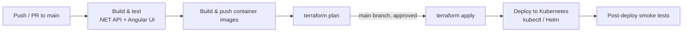

# CI/CD and deployment

Covenant is built, tested, and deployed entirely through GitHub Actions. Infrastructure is provisioned separately from application code via Terraform, so an application deploy never implicitly changes infrastructure.

## Pipeline overview

## What each stage does

- **Build & test** — restores and builds the .NET solution, runs unit and integration tests (against ephemeral Postgres/OpenSearch/LavinMQ containers spun up in the workflow), builds and lints the Angular UI.
- **Build & push container images** — builds the API and UI images and pushes them to the container registry, tagged with the commit SHA.
- **terraform plan** — runs on every pull request touching `infrastructure/`, posting the plan output as a PR comment for review. Nothing is applied automatically from a PR.
- **terraform apply** — runs only on `main`, after the plan has been reviewed, provisioning/updating the EKS cluster, Aurora PostgreSQL, Amazon OpenSearch Service, networking, and IAM roles.
- **Deploy to Kubernetes** — applies the updated manifests/Helm chart, pointing at the newly built image tags.
- **Post-deploy smoke tests** — verifies the API health endpoint and a read-only query path before the deploy is considered successful.

## Environments

| Environment | Trigger | Purpose |
|---|---|---|
| `dev` | Every merge to `main` | Continuous integration target; always reflects `main`. |
| `staging` | Manual promotion (tag) | Pre-production validation against production-like data volumes. |
| `production` | Manual promotion (tag) + approval gate | Customer-facing environment. |

## Local development

Locally, none of this pipeline is needed: `.NET Aspire` starts the API and its dependencies (Postgres, OpenSearch, LavinMQ) with `dotnet run`, and the Angular UI runs against that locally-orchestrated backend with its own dev server.

## Credentials

GitHub Actions authenticates to AWS via OpenID Connect (OIDC) — no long-lived AWS access keys are stored as repository secrets. The workflow assumes a short-lived IAM role scoped to the specific actions (ECR push, EKS deploy, Terraform state access) each job needs.
